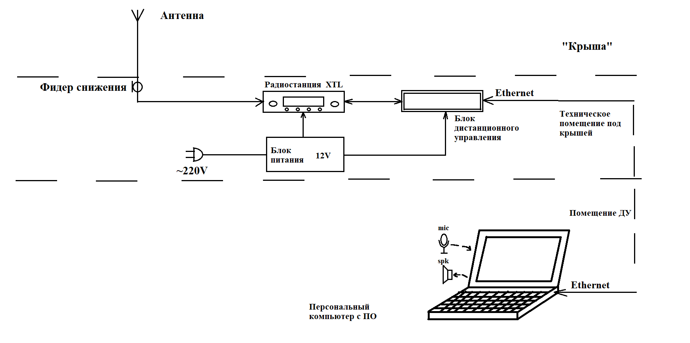

# Система дистанционного управления радиостанцией

**Руководство и курирование:** Пономарев И.Э., Кошелев А.И.

**Исполнители:** Тулупов Н.Д., Осипов А.С.

***ПромСвязьРадио, Москва, 2025***

## Аннотация

При строительстве новых зданий территориальных отделов внутренних дел в Москве и Новой Москве их необходимо оснащать средствами радиосвязи. Типовые здания ОВД имеют 2-3 этажа и часто окружены высотной застройкой, что создает зону радиотени. Дежурные части, которые должны пользоваться радиосвязью, размещают на первом этаже зданий, что усугубляет ситуацию. Также при введении плана "Крепость" окна помещений дежурного участка (ДУ) закрываются металлическими ставнями.

Установка радиостанций в участках требует подключения их к антеннам, обычно размещаемым на крышах, коаксиальным кабелем значительной длины. Это приводит к большому затуханию сигналов диапазона 450 МГц в кабеле и, зачастую, к невозможности установления связи. Также существуют технические требования к прокладке коаксиальных кабелей, системе заземления и грозозащиты, не всегда возможные к реализации на столе дежурных в ДУ.

Помимо описанных случаев существует достаточное количество объектов, где требуется установка радиостанции поближе к антеннам.

В нашем случае, в Москве и других городах, где наша компания построила системы цифровой УКВ радиосвязи стандарта APCO25 производства компании Motorola, используются в основном радиостанции типа XTL2500 и XTL1500. Ранее мы поставляли специализированные для такой ситуации изделия от Motorola - под брендом [APX® Consolettes](https://www.motorolasolutions.com/en_us/products/dispatch/dispatch-consoles/apx-consolettes.html#tabproductinfo) вкупе со специальными выносными пультами управления.

Возникла идея создать собственную систему дистанционного управления указанными типами радиостанций на основе универсального компьютера, оснащенного микрофоном, акустикой и специальным ПО.

Задача выполнена сотрудниками компании, студентами ФРКТ МФТИ Тулуповым Н.Д. и Осиповым А.С. Для работы предоставлено следующее оборудование:

- Радиостанция XTL2500 (тестовый образец из сервиса)
- Блок питания 12В (отремонтированный экземпляр из списанных)
- Тестовая RF нагрузка 50 Ом, 50Вт, набор кабелей к радиостанции (оборудование сервиса)
- Одноплатный компьютер (собственность Кошелева А.И.)

## Основные части проекта

### Пульт диспетчера

Компьютер со встроенными/подключаемыми акустической системой и микрофоном и с разработанным программным обеспечением.

- Воспроизведение передачи аудиосигнала, поступающего со станции, запись и передача сигнала из диспетчерской для передачи с помощью соответствующей гарнитуры.
- Управление станцией (изменение мощности сигнала, включение режима передачи или сканирования, смена канала и группы каналов) с помощью экранных кнопок, копирующих кнопки на радиостанции.
- Отображение дисплея, копирующего информацию с дисплея удаленной радиостанции.

### Блок дистанционного управления

Реализован на готовом покупном одноплатном компьютере RaspberryPi 3b и собранной для него интерфейсной схемы, обеспечивающей подключение к радиостанции.

Такое решение не потребует серьезного производства "железа", обеспечит минимум затрат на изготовление и гибкость в выборе составных частей.

## Этапы проекта

### Сентябрь 2024

- Изучение функционала радиостанции Motorola Astro XTL 2500 и возможностей лицензионной программы Astro 25.
- Изучение протокола SB9600, составление описания и последовательности его команд.

### Октябрь - Ноябрь 2024

- Разработка аппаратного модуля сопряжения радиостанции и RaspberryPi.
- Разработка ПО для передачи команд от пульта управления к радиостанции по протоколу Ethernet.

### Ноябрь - Декабрь 2024

- Разработка графического интерфейса для пользователя на пульте управления (аналогичного интерфейсу управления станцией напрямую).
- Разработка ПО для передачи команд от радиостанции к пульту управления по протоколу Ethernet.

### Январь - Февраль 2025

- Разработка ПО для передачи аудио от и на радиостанцию.

### Март 2025

- Создание завершенного аппаратного макета и ПО.
- Демонстрация, испытания.

### Апрель - Июнь 2025

- Создание пакета пользовательской и технической документации.
- Реализация проекта.

---
